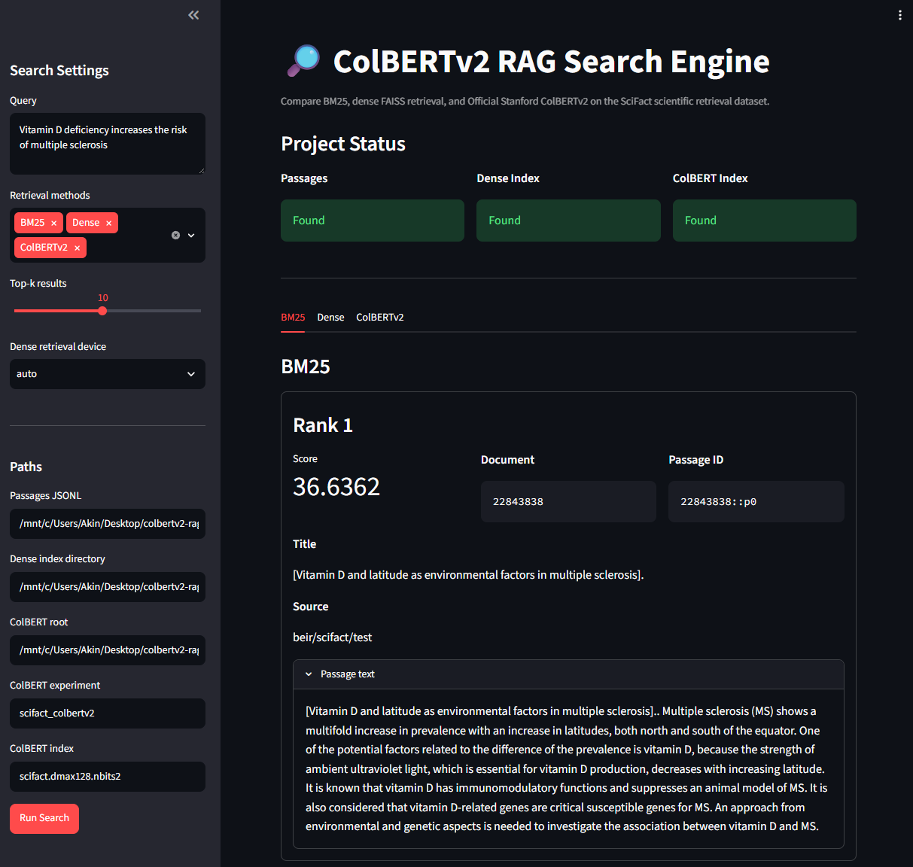
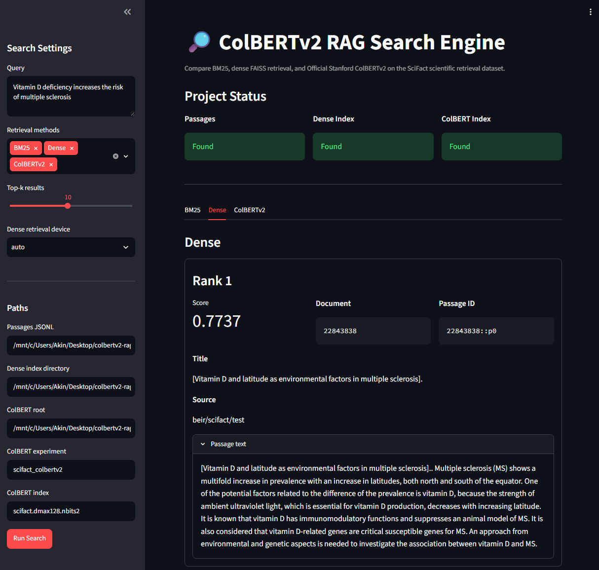
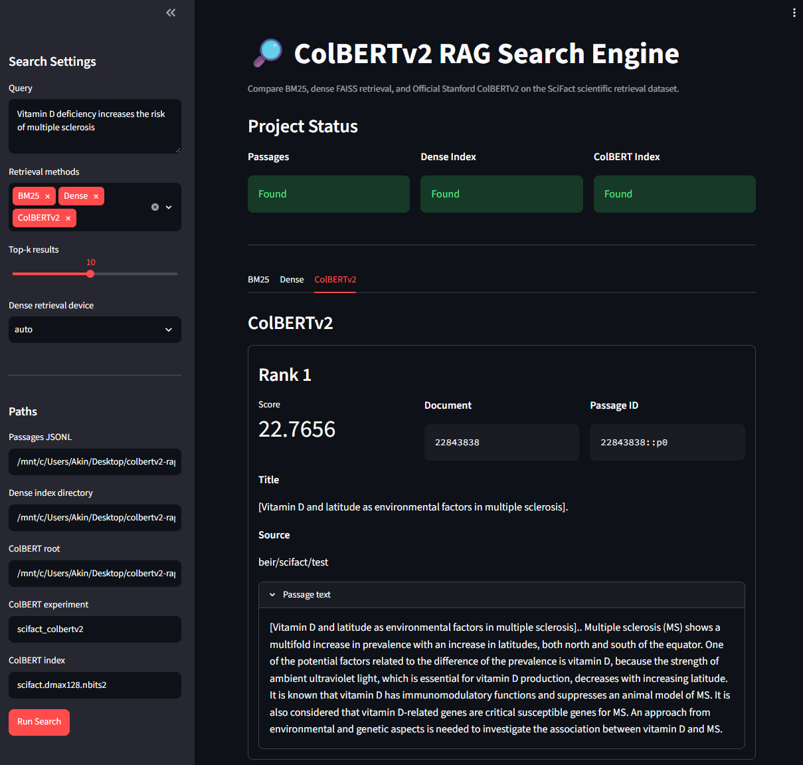

# ColBERTv2 RAG Search Engine

A retrieval-first scientific search project that compares **BM25**, **dense retrieval with Sentence Transformers and FAISS**, and the **Official Stanford ColBERTv2 implementation** on the **BEIR SciFact** benchmark.

The project focuses on the retrieval layer of Retrieval-Augmented Generation systems. It provides an end-to-end pipeline for dataset preparation, passage indexing, retrieval, evaluation, and interactive result comparison through a Streamlit interface.

---

## Overview

The quality of a Retrieval-Augmented Generation system depends heavily on the documents retrieved before an answer is generated.

This project explores three different information retrieval approaches:

* **BM25:** lexical keyword-based retrieval
* **Dense retrieval:** single-vector semantic retrieval with Sentence Transformers and FAISS
* **ColBERTv2:** token-level late interaction using the Official Stanford ColBERT implementation

All retrieval methods are evaluated on the same queries and relevance judgments so their behavior can be compared under a shared evaluation setup.

The current project implements the complete retrieval pipeline. LLM-based answer generation is planned as a future extension.

---

## Features

* BEIR SciFact dataset ingestion
* Scientific document and query preparation
* Overlapping passage chunking
* BM25 lexical retrieval
* Dense semantic retrieval with Sentence Transformers
* FAISS vector index creation and search
* Official Stanford ColBERTv2 indexing
* Official Stanford ColBERTv2 search
* Shared evaluation pipeline
* Recall@5 and Recall@10
* MRR@10
* nDCG@10
* Passage-to-document deduplication
* JSON and Markdown evaluation reports
* Interactive Streamlit search interface
* Multi-method result comparison
* GPU-accelerated ColBERTv2 execution through WSL Ubuntu

---

## Dataset

The project uses the **BEIR SciFact test split** through `ir_datasets`.

SciFact contains scientific claims, scientific documents, and relevance judgments. It is suitable for comparing retrieval systems because relevant evidence often requires both exact scientific terminology and semantic understanding.

### Processed dataset statistics

| Data type           | Count |
| ------------------- | ----: |
| Documents           | 5,183 |
| Queries             |   300 |
| Relevance judgments |   339 |
| Generated passages  | 8,854 |

Processed files are generated locally under:

```text
data/processed/
```

The generated dataset is excluded from Git because it can be reproduced with the ingestion scripts.

---

## Retrieval Methods

### BM25

BM25 is used as the lexical retrieval baseline.

It ranks passages based on query-term overlap and term importance. BM25 remains especially effective when scientific claims contain terminology that also appears directly in relevant abstracts.

Implementation:

```text
src/retrieval/bm25.py
```

Example:

```bash
python -m src.retrieval.bm25 \
  --query "Vitamin D deficiency increases the risk of multiple sclerosis" \
  --top-k 5
```

---

### Dense Retrieval

Dense retrieval represents each passage and query as a single semantic vector.

The project uses:

```text
sentence-transformers/all-mpnet-base-v2
```

Passage embeddings are normalized and stored in a FAISS inner-product index.

Implementation:

```text
src/retrieval/build_dense_index.py
src/retrieval/dense.py
```

Build the dense index:

```bash
python -m src.retrieval.build_dense_index --batch-size 32
```

Search the dense index:

```bash
python -m src.retrieval.dense \
  --query "Vitamin D deficiency increases the risk of multiple sclerosis" \
  --top-k 5
```

Generated dense index files:

```text
indexes/dense/
├── index.faiss
├── metadata.json
└── passages.jsonl
```

---

### Official Stanford ColBERTv2

ColBERTv2 uses a late-interaction retrieval architecture.

Instead of representing an entire passage with a single vector, ColBERT keeps contextualized token-level representations. During retrieval, query tokens interact with passage tokens through MaxSim scoring.

This project uses the Official Stanford ColBERT implementation rather than a simplified reimplementation.

Implementation:

```text
src/retrieval/prepare_colbert_official.py
src/retrieval/build_colbert_official_index.py
src/retrieval/colbert_official.py
```

Prepared ColBERT files:

```text
data/processed/colbert/
├── collection.tsv
├── metadata.json
├── pid_mapping.jsonl
├── qrels.tsv
└── queries.tsv
```

Prepare official ColBERT input files:

```bash
python -m src.retrieval.prepare_colbert_official
```

Build the ColBERTv2 index:

```bash
python -m src.retrieval.build_colbert_official_index \
  --doc-maxlen 128 \
  --kmeans-niters 1 \
  --index-name scifact.dmax128.nbits2 \
  --root colbert_experiments
```

Search with ColBERTv2:

```bash
python -m src.retrieval.colbert_official \
  --query "Vitamin D deficiency increases the risk of multiple sclerosis" \
  --top-k 5 \
  --index-name scifact.dmax128.nbits2 \
  --root colbert_experiments
```

Example top result:

```text
Rank:       1
Score:      22.7656
Passage ID: 22843838::p0
Document:   22843838
Title:      [Vitamin D and latitude as environmental factors in multiple sclerosis].
```

---

## Streamlit Demo

The project includes an interactive Streamlit interface for testing and comparing the retrieval systems.

The interface supports:

* Scientific query input
* Selection of one or more retrieval methods
* Top-k result configuration
* Dense retrieval device selection
* BM25 result visualization
* Dense FAISS result visualization
* ColBERTv2 result visualization
* Separate result tabs for each selected method
* Passage text inspection
* Local index and dataset status checks

Start the application:

```bash
streamlit run app/streamlit_app.py
```

Open the local URL displayed by Streamlit, normally:

```text
http://localhost:8501
```

### BM25 Retrieval

BM25 provides the lexical keyword-based baseline.



### Dense Retrieval

Dense retrieval uses Sentence Transformers and FAISS to retrieve semantically related passages.



### Official ColBERTv2 Retrieval

ColBERTv2 performs token-level late interaction through the Official Stanford implementation.



---

## Evaluation

All methods are evaluated with the same queries and SciFact relevance judgments.

The retrievers initially return passage-level results. Before metric calculation, passages are converted into deduplicated document rankings using their document IDs.

### Evaluation configuration

| Setting                   |     Value |
| ------------------------- | --------: |
| Evaluated queries         |       300 |
| Candidate passage depth   |        50 |
| Evaluation document depth |        10 |
| Passage chunk size        | 180 words |
| Passage overlap           |  40 words |

### Metrics

* **Recall@5:** proportion of relevant documents retrieved within the first five results
* **Recall@10:** proportion of relevant documents retrieved within the first ten results
* **MRR@10:** ranking quality based on the first relevant result
* **nDCG@10:** ranking quality while considering graded relevance and position

---

## Evaluation Results

| Method    | Recall@5 | Recall@10 | MRR@10 | nDCG@10 | Notes                              |
| --------- | -------: | --------: | -----: | ------: | ---------------------------------- |
| BM25      |   0.7112 |    0.7640 | 0.6162 |  0.6471 | Lexical keyword baseline           |
| Dense     |   0.7127 |    0.7981 | 0.6062 |  0.6480 | Sentence Transformers and FAISS    |
| ColBERTv2 |   0.6784 |    0.7597 | 0.5872 |  0.6224 | Official Stanford late interaction |

---

## Result Interpretation

BM25 remains a strong baseline on SciFact. Scientific claims frequently contain terminology that also appears directly in relevant scientific abstracts, making lexical retrieval effective.

The dense retriever achieved the highest Recall@10 and slightly improved nDCG@10 in the current experiment. This indicates that semantic vector retrieval recovered more relevant documents deeper in the ranking.

The Official Stanford ColBERTv2 pipeline was successfully integrated, indexed, searched, and evaluated end to end.

The ColBERTv2 index used a lightweight local configuration:

```text
doc_maxlen = 128
nbits = 2
kmeans_niters = 1
```

These parameters were selected to make the experiment reproducible on local hardware. The current ColBERTv2 result should therefore be interpreted as a reproducible official implementation baseline rather than a fully optimized ColBERT configuration.

Possible ColBERT improvements include:

* Increasing `doc_maxlen`
* Increasing `kmeans_niters`
* Testing alternative compression settings
* Increasing candidate retrieval depth
* Applying ColBERT as a reranker
* Dataset-specific passage preprocessing
* Hyperparameter experimentation

---

## Project Structure

```text
colbertv2-rag-search-engine/
├── README.md
├── requirements.txt
├── requirements-colbert-official.txt
├── .env.example
├── .gitignore
├── app/
│   └── streamlit_app.py
├── configs/
├── data/
│   ├── raw/
│   └── processed/
│       ├── documents.jsonl
│       ├── passages.jsonl
│       ├── qrels.jsonl
│       ├── queries.jsonl
│       └── colbert/
│           ├── collection.tsv
│           ├── metadata.json
│           ├── pid_mapping.jsonl
│           ├── qrels.tsv
│           └── queries.tsv
├── docs/
│   └── images/
│       ├── bm25-results.png
│       ├── dense-results.png
│       └── colbertv2-results.png
├── experiments/
│   └── evaluation/
│       └── summary.md
├── indexes/
│   └── dense/
│       ├── index.faiss
│       ├── metadata.json
│       └── passages.jsonl
├── notebooks/
├── src/
│   ├── ingestion/
│   │   ├── chunk_docs.py
│   │   └── load_scifact.py
│   ├── retrieval/
│   │   ├── bm25.py
│   │   ├── build_colbert_official_index.py
│   │   ├── build_dense_index.py
│   │   ├── colbert_official.py
│   │   ├── compare.py
│   │   ├── dense.py
│   │   └── prepare_colbert_official.py
│   ├── evaluation/
│   │   ├── metrics.py
│   │   └── run_eval.py
│   ├── api/
│   │   └── main.py
│   └── rag/
│       └── answer_generator.py
└── tests/
```

---

## Standard Environment Setup

The standard environment supports:

* Dataset ingestion
* Passage creation
* BM25 retrieval
* Dense retrieval
* FAISS indexing
* Standard evaluation

### Windows

```powershell
python -m venv .venv
.venv\Scripts\activate
python -m pip install --upgrade pip setuptools wheel
python -m pip install -r requirements.txt
```

### Linux or macOS

```bash
python -m venv .venv
source .venv/bin/activate
python -m pip install --upgrade pip setuptools wheel
python -m pip install -r requirements.txt
```

---

## Data Preparation

Download and prepare the SciFact dataset:

```bash
python -m src.ingestion.load_scifact
```

Create overlapping passages:

```bash
python -m src.ingestion.chunk_docs
```

Expected output:

```text
Documents: 5183
Queries:   300
Qrels:     339
Passages created: 8854
```

---

## Dense Index Creation

Build the FAISS dense index:

```bash
python -m src.retrieval.build_dense_index --batch-size 32
```

The current dense index contains:

```text
Indexed passages: 8,854
Vector dimension: 768
```

Index creation time depends on the selected device and local hardware.

---

## Retrieval Comparison

Compare BM25 and dense retrieval for the same query:

```bash
python -m src.retrieval.compare \
  --query "Vitamin D deficiency increases the risk of multiple sclerosis" \
  --top-k 5
```

The comparison script displays:

* BM25 results
* Dense results
* Common passages
* Common documents
* Unique document counts
* Document-level Jaccard overlap

---

## Official ColBERTv2 Environment

Official ColBERTv2 is run in a separate WSL Ubuntu Conda environment because its CUDA, NCCL, FAISS, and C++ extension requirements are better supported on Linux.

### Tested environment

| Component        | Value                              |
| ---------------- | ---------------------------------- |
| Operating system | WSL Ubuntu                         |
| Python           | 3.10.20                            |
| GPU              | NVIDIA GeForce RTX 4070 Laptop GPU |
| PyTorch          | 2.13.0+cu126                       |
| CUDA available   | Yes                                |
| NCCL available   | Yes                                |
| Transformers     | 4.45.2                             |
| NumPy            | 1.26.4                             |
| SciPy            | 1.14.1                             |
| FAISS            | faiss-cpu 1.8.0                    |
| Compiler         | GCC/G++ 13                         |

### Create the environment

```bash
conda create -n colbert-official -c conda-forge \
  python=3.10 \
  numpy=1.26.4 \
  scipy=1.14.1 \
  pandas \
  tqdm \
  python-dotenv \
  -y

conda activate colbert-official
```

### Install PyTorch with CUDA

```bash
python -m pip install --upgrade pip setuptools wheel

python -m pip install torch torchvision torchaudio \
  --index-url https://download.pytorch.org/whl/cu126
```

### Install FAISS

```bash
python -m pip install --no-deps faiss-cpu==1.8.0
```

### Install ColBERT and supporting packages

```bash
python -m pip install colbert-ai

python -m pip uninstall -y transformers tokenizers
python -m pip install transformers==4.45.2

python -m pip install \
  ir-datasets \
  rank-bm25 \
  sentence-transformers \
  streamlit
```

### Install build dependencies

```bash
sudo apt update
sudo apt install -y \
  build-essential \
  gcc-13 \
  g++-13 \
  ninja-build
```

Install CUDA development packages compatible with the PyTorch CUDA build:

```bash
conda install -c nvidia \
  "cuda-toolkit=12.6.*" \
  "cuda-nvcc=12.6.*" \
  "cuda-cudart-dev=12.6.*" \
  "cuda-libraries-dev=12.6.*" \
  "cuda-cccl=12.6.*" \
  -y
```

---

## ColBERT Environment Variables

Official ColBERT compiles custom CUDA and C++ extensions during indexing and the first search.

Set the following environment variables before building or loading the ColBERT index:

```bash
export CUDA_HOME="$CONDA_PREFIX"
export CUDA_PATH="$CONDA_PREFIX"

export CPATH="$CONDA_PREFIX/targets/x86_64-linux/include/cccl:$CONDA_PREFIX/include:$CONDA_PREFIX/targets/x86_64-linux/include"

export CPLUS_INCLUDE_PATH="$CONDA_PREFIX/targets/x86_64-linux/include/cccl:$CONDA_PREFIX/include:$CONDA_PREFIX/targets/x86_64-linux/include"

export LIBRARY_PATH="$CONDA_PREFIX/lib:$CONDA_PREFIX/lib64:$CONDA_PREFIX/targets/x86_64-linux/lib"

export LD_LIBRARY_PATH="$CONDA_PREFIX/lib:$CONDA_PREFIX/lib64:$CONDA_PREFIX/targets/x86_64-linux/lib"

export CC=/usr/bin/gcc-13
export CXX=/usr/bin/g++-13
export CUDAHOSTCXX=/usr/bin/g++-13
export CUDACXX="$CONDA_PREFIX/bin/nvcc"

export PYTHONUTF8=1
```

Verify the environment:

```bash
python -c "
import torch
import faiss
import colbert
import transformers

from colbert import Indexer, Searcher
from colbert.infra import Run, RunConfig, ColBERTConfig

print('Torch:', torch.__version__)
print('CUDA:', torch.cuda.is_available())
print('Device:', torch.cuda.get_device_name(0))
print('NCCL:', torch.distributed.is_nccl_available())
print('Transformers:', transformers.__version__)
print('FAISS OK')
print('ColBERT API OK')
"
```

---

## ColBERT Index Creation

Prepare the official input files:

```bash
python -m src.retrieval.prepare_colbert_official
```

Create the index:

```bash
python -m src.retrieval.build_colbert_official_index \
  --doc-maxlen 128 \
  --kmeans-niters 1 \
  --index-name scifact.dmax128.nbits2 \
  --root colbert_experiments
```

Expected index location:

```text
colbert_experiments/
└── scifact_colbertv2/
    └── indexes/
        └── scifact.dmax128.nbits2/
```

The first build compiles ColBERT CUDA extensions and may take longer than later executions.

---

## Running the Streamlit Application

Activate the ColBERT environment:

```bash
conda activate colbert-official
```

Set the required CUDA and compiler environment variables, then run:

```bash
streamlit run app/streamlit_app.py
```

The interface can load all three retrieval methods from the same environment.

---

## Running Evaluations

### BM25

```bash
python -m src.evaluation.run_eval --method bm25
```

### Dense retrieval

```bash
python -m src.evaluation.run_eval --method dense
```

### ColBERTv2

```bash
python -m src.evaluation.run_eval --method colbert
```

### All methods

```bash
python -m src.evaluation.run_eval --method all
```

### Quick debugging run

```bash
python -m src.evaluation.run_eval \
  --method colbert \
  --max-queries 10
```

Reports are generated under:

```text
experiments/evaluation/
```

The JSON reports contain per-query rankings and metrics. The Markdown summary contains a repository-friendly result table.

---

## Troubleshooting

### Dense model JSON error

A partially downloaded Hugging Face model cache may produce:

```text
JSONDecodeError: Expecting value
```

Remove the cached model and download it again:

```bash
rm -rf ~/.cache/huggingface/hub/models--sentence-transformers--all-mpnet-base-v2

rm -rf ~/.cache/torch/sentence_transformers/sentence-transformers_all-mpnet-base-v2
```

Test the model:

```bash
python -c "
from sentence_transformers import SentenceTransformer

SentenceTransformer('sentence-transformers/all-mpnet-base-v2')
print('Dense model OK')
"
```

### ColBERT extension cache

If a ColBERT CUDA extension build fails after changing CUDA or compiler settings:

```bash
rm -rf ~/.cache/torch_extensions
```

Delete the incomplete index before rebuilding:

```bash
rm -rf \
  colbert_experiments/scifact_colbertv2/indexes/scifact.dmax128.nbits2
```

### Unsupported GCC version

CUDA may reject GCC versions newer than the supported range.

Use GCC 13:

```bash
export CC=/usr/bin/gcc-13
export CXX=/usr/bin/g++-13
export CUDAHOSTCXX=/usr/bin/g++-13
```

---

## Generated Files

The following directories contain locally generated data, embeddings, indexes, or reports:

```text
data/processed/
indexes/
colbert_experiments/
experiments/evaluation/*.json
```

These files are excluded from Git because they can be regenerated.

Recommended `.gitignore` rules:

```gitignore
# Python environments
.venv/
.env

# Python cache
__pycache__/
*.pyc

# Generated datasets
data/raw/
data/processed/

# Generated indexes
indexes/
colbert_experiments/

# Evaluation output
experiments/evaluation/*.json
!experiments/evaluation/summary.md

# Local model artifacts
artifacts/
models/
```

---

## Current Project Status

### Completed

* [x] SciFact dataset ingestion
* [x] Scientific document preparation
* [x] Passage chunking
* [x] BM25 retrieval
* [x] Dense Sentence Transformer retrieval
* [x] FAISS indexing
* [x] Official Stanford ColBERTv2 preparation
* [x] Official Stanford ColBERTv2 indexing
* [x] Official Stanford ColBERTv2 search
* [x] Shared retrieval evaluation
* [x] Document-level result deduplication
* [x] Streamlit interface
* [x] Multi-method result comparison
* [x] Retrieval screenshots and documentation

### Planned

* [ ] FastAPI retrieval endpoints
* [ ] Source-grounded RAG answer generation
* [ ] LLM provider integration
* [ ] Citation-aware generated answers
* [ ] ColBERT reranking experiments
* [ ] Additional BEIR datasets
* [ ] Automated tests for retrieval pipelines
* [ ] Docker-based local deployment
* [ ] Public hosted demo

---

## Engineering Decisions

### Retrieval-first development

The project develops and evaluates retrieval before adding answer generation. This makes it possible to measure whether retrieved evidence is actually relevant before introducing an LLM.

### Shared evaluation pipeline

All methods are evaluated with the same queries, relevance judgments, candidate depth, and document-ranking conversion.

### Separate ColBERT environment

Official ColBERT requires a more specialized CUDA and compilation environment. It is therefore isolated from the standard project environment through WSL Ubuntu and Conda.

### Generated indexes are not committed

Dense and ColBERT indexes are reproducible but large. They are intentionally excluded from version control.

---

## Why This Project Matters

Many RAG demonstrations focus primarily on sending retrieved text to an LLM. However, retrieval quality determines whether the model receives useful, relevant, and trustworthy evidence.

This project demonstrates practical experience with:

* Classical information retrieval
* Semantic vector retrieval
* Late-interaction neural retrieval
* Scientific benchmark evaluation
* FAISS indexing
* CUDA-enabled PyTorch
* Official ColBERT integration
* Local GPU troubleshooting
* Streamlit application development
* Reproducible AI engineering workflows

---

## Author Note

I built this project to strengthen my understanding of modern information retrieval systems and retrieval-augmented generation foundations.

The main objective was to implement and compare retrieval approaches instead of treating RAG as a black box. Building BM25, dense retrieval, and Official ColBERTv2 under the same evaluation pipeline provided a clearer understanding of the trade-offs between lexical matching, semantic vector similarity, and token-level late interaction.
